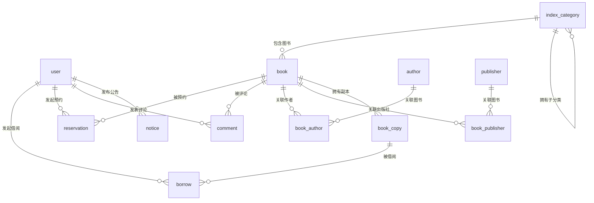

# 在线图书馆管理系统数据库表设计文档

## 实体表

### 用户表（user）

| 字段名           | 类型           | 说明                      | 关联关系 |
|---------------|--------------|-------------------------|------|
| id            | bigint       | 主键                      | -    |
| username      | varchar(50)  | 用户名                     | -    |
| password_hash | varchar(100) | 加密密码                    | -    |
| email         | varchar(100) | 邮箱                      | -    |
| role          | tinyint      | 用户角色（1：普通用户，2：管理员，3：馆员） | -    |
| create_time   | datetime     | 创建时间                    | -    |
| update_time   | datetime     | 更新时间                    | -    |

### 图书表（book）

| 字段名               | 类型           | 说明                     | 关联关系                |
|-------------------|--------------|------------------------|---------------------|
| id                | bigint       | 主键                     | -                   |
| isbn              | varchar(20)  | ISBN号                  | -                   |
| index_category_id | bigint       | 索引分类ID（外键）             | `index_category.id` |
| location_id       | bigint       | 位置ID（关联book_location表） | `book_location.id`  |
| title             | varchar(100) | 书名                     | -                   |
| create_time       | datetime     | 创建时间                   | -                   |

### 分类表（index_category）

| 字段名         | 类型          | 说明             | 关联关系                |
|-------------|-------------|----------------|---------------------|
| id          | bigint      | 主键             | -                   |
| index_code  | varchar(20) | 分类编码（唯一）       | -                   |
| name        | varchar(50) | 分类名称           | -                   |
| parent_id   | bigint      | 父分类ID（0表示顶级分类） | `index_category.id` |
| create_time | datetime    | 创建时间           | -                   |

### 出版社表（publisher）

| 字段名         | 类型           | 说明    | 关联关系 |
|-------------|--------------|-------|------|
| id          | bigint       | 主键    | -    |
| name        | varchar(100) | 出版社名称 | -    |
| location    | varchar(200) | 所在地   | -    |
| contact     | varchar(100) | 联系方式  | -    |
| create_time | datetime     | 创建时间  | -    |
| update_time | datetime     | 更新时间  | -    |

### 作者表（author）

| 字段名         | 类型          | 说明   | 关联关系 |
|-------------|-------------|------|------|
| id          | bigint      | 主键   | -    |
| name        | varchar(50) | 作者姓名 | -    |
| biography   | text        | 作者简介 | -    |
| country     | varchar(50) | 国籍   | -    |
| create_time | datetime    | 创建时间 | -    |
| update_time | datetime    | 更新时间 | -    |

### 公告表（notice）

| 字段名             | 类型           | 说明             | 关联关系      |
|-----------------|--------------|----------------|-----------|
| id              | bigint       | 主键             | -         |
| title           | varchar(100) | 公告标题           | -         |
| content         | text         | 公告内容           | -         |
| creator_user_id | bigint       | 发布者ID（关联user表） | `user.id` |
| publish_time    | datetime     | 发布时间           | -         |
| expire_time     | datetime     | 过期时间           | -         |
| status          | tinyint      | 状态（1：显示，2：置顶）  | -         |
| create_time     | datetime     | 创建时间           | -         |
| update_time     | datetime     | 更新时间           | -         |

### 评论表（comment）

| 字段名         | 类型       | 说明                    | 关联关系      |
|-------------|----------|-----------------------|-----------|
| id          | bigint   | 主键                    | -         |
| user_id     | bigint   | 评论用户ID（关联user表）       | `user.id` |
| book_id     | bigint   | 图书ID（关联book表）         | `book.id` |
| content     | text     | 评论内容                  | -         |
| rating      | int      | 评分（1-5星）              | -         |
| create_time | datetime | 评论时间                  | -         |
| status      | tinyint  | 状态（1：审核中，2：已发布，3：已删除） | -         |

### 图书副本表（book_copy）

| 字段名              | 类型           | 说明                        | 关联关系      |
|------------------|--------------|---------------------------|-----------|
| id               | bigint       | 主键                        | -         |
| book_id          | bigint       | 图书ID（外键，关联book表）          | `book.id` |
| barcode          | varchar(100) | 条码（用于扫码借还）                | -         |
| status           | tinyint      | 状态（1：可借，2：已借，3：维修中，4：已报废） | -         |
| purchase_time    | datetime     | 采购时间                      | -         |
| last_maintenance | datetime     | 最后维护时间                    | -         |
| create_time      | datetime     | 创建时间                      | -         |
| update_time      | datetime     | 更新时间                      | -         |

## 关系表

### 借阅表（borrow）

| 字段名                | 类型            | 说明                    | 关联关系           |
|--------------------|---------------|-----------------------|----------------|
| id                 | bigint        | 主键                    | -              |
| user_id            | bigint        | 用户ID（外键，关联user表）      | `user.id`      |
| copy_id            | bigint        | 副本ID（外键，关联book_copy表） | `book_copy.id` |
| borrow_time        | datetime      | 借阅时间                  | -              |
| return_time        | datetime      | 应还时间                  | -              |
| actual_return_time | datetime      | 实际还书时间                | -              |
| status             | tinyint       | 状态（1：借阅中，2：已还，3：逾期）   | -              |
| fine               | decimal(10,2) | 逾期费用                  | -              |
| create_time        | datetime      | 创建时间                  | -              |
| update_time        | datetime      | 更新时间                  | -              |

### 预约表（reservation）

| 字段名              | 类型       | 说明                   | 关联关系      |
|------------------|----------|----------------------|-----------|
| id               | bigint   | 主键                   | -         |
| user_id          | bigint   | 用户ID（外键，关联user表）     | `user.id` |
| book_id          | bigint   | 图书ID（外键，关联book表）     | `book.id` |
| reservation_time | datetime | 预约时间                 | -         |
| status           | tinyint  | 状态（1：待取，2：已取消，3：已过期） | -         |
| notice_time      | datetime | 到馆通知时间               | -         |
| create_time      | datetime | 创建时间                 | -         |
| update_time      | datetime | 更新时间                 | -         |

### 图书作者关联表（book_author）

| 字段名               | 类型          | 说明                   | 关联关系        |
|-------------------|-------------|----------------------|-------------|
| id                | bigint      | 主键                   | -           |
| book_id           | bigint      | 图书ID（外键，关联book表）     | `book.id`   |
| author_id         | bigint      | 作者ID（外键，关联author表）   | `author.id` |
| contribution_type | varchar(50) | 贡献类型 (如: 作者, 编者, 译者) | -           |
| create_time       | datetime    | 创建时间                 | -           |
| update_time       | datetime    | 更新时间                 | -           |

### 图书出版社关联表（book_publisher）

| 字段名                 | 类型           | 说明                      | 关联关系           |
|---------------------|--------------|-------------------------|----------------|
| id                  | bigint       | 主键                      | -              |
| book_id             | bigint       | 图书ID（外键，关联book表）        | `book.id`      |
| publisher_id        | bigint       | 出版社ID（外键，关联publisher表）  | `publisher.id` |
| create_time         | datetime     | 创建时间                    | -              |
| update_time         | datetime     | 更新时间                    | -              |

## 整体E-R图

